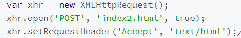
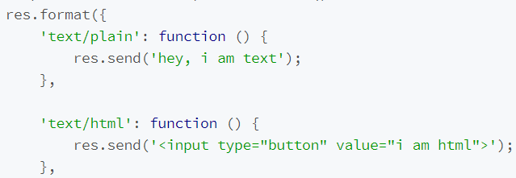

# express

```js
const express = require('express')
const app = express()
app.use((req, res, next) => {
  console.log(`use: ${req.url}`) //use: 不论是什么方法都会进
  next()
})
app.get('/api', (req, res, next) => {
  console.log(`get: ${req.url}`) //get请求的时候会进
  next()
})
app.get('/api/foo', (req, res, next) => {
  console.log(`get: ${req.url}`) //get请求的时候会进
  next()
})
app.listen('3000', () => {
  console.log(`app is running in port 3000`)
})
```

- 访问 http://localhost:3000/api
  会进 use /api，因为 use 写了 next()，所以会进 get /api
- 访问 http://localhost:3000/api/foo
  同理会进 use /api 和 get /api/foo

```js
app.get('/user/:name', (req, res) => {
  res.send(req.params.name)
})
```

:name: 通过 req.params.name 取到实际的值

比如访问 `http://localhost:3000/user/hello` 返回的是 `hello`

## next()

```js
app.all('/user/:name', (req, res, next) => {
  console.log(req.params.name)
})
// 页面始终在 pending（因为第一个没有返回）；第二个路径被拦截，不会执行
app.get('/user/:name', (req, res) => {
  res.send('world')
})
```

```js
app.get('/user/:name', (req, res, next) => {
  console.log(req.params.name)
  next()
})
// 调用 next 进行链式调用
app.get('/user/:name', (req, res) => {
  res.send('world')
})
```

## res.send

## res.format

根据 ajax 的请求消息头返回对应的内容

页面 ajax



express 内响应



## NODE_ENV

告知 Node 程序运行在哪个环境中，其默认是开发环境

## use(middleware)

app.use 加载用于处理 http 請求的 middleware（中间件），当一个请求来的时候，会依次被这些 middlewares 处理  
当业务逻辑复杂的时候，为了明确和便于维护，需要把处理的事情分一下，分配成几个部分来做，而每个部分就是一个中间件  
本质上中间件就是个函数

```js
const express = require('express')
const app = express()

// 示例中间件函数
const a_middleware_function = (req, res, next) => {
  // ... 进行一些操作
  next() // 调用 next() ，Express 将调用处理链中下一个中间件函数。
}

// 用 use() 为所有的路由和动词添加该函数
app.use(a_middleware_function)

// 用 use() 为一个特定的路由添加该函数
app.use('/someroute', a_middleware_function)

// 为一个特定的 HTTP 动词和路由添加该函数
app.get('/', a_middleware_function)

app.listen(3000)
```

- 使用 app.use(fn)后，传进来的 fn 就会被扔到一个函数数组
- 执行完毕后调用 next()方法执行函数数组里的下一个函数，如果没有调用 next()的话，就不会调用下一个函数
- 中间件存在调用顺序，要保证依赖顺序正常

## 路由拆分

利用 `use`  
比如将 `user` 模块作为 `/user` 的路由

```js
/* user.js */
const express = require('express')
const router = express.Router()

router.get('/', (req, res) => {
  console.log('/')
})

router.get('/about', (req, res) => {
  res.send('about') // 访问 /user/about 返回 `about`
})
module.exports = router
```

```js
/* app.js */
const express = require('express')
const app = express()

const user = require('./user')
// 特定路由添加的中间件
app.use('/user', user)
```

## express.static

读取静态文件，包括 CSS、图片、文件等

```js
app.use(express.static('public')) // static 其实是一个中间件
app.use(express.static('media')) // 如果 public 内没有找到对应的资源，会去找 media
```

`public` 文件夹可以直接通过路由访问，比如 `http://localhost:3000/images/dog.jpg`

```js
// 指定路由
app.use('/media', express.static('public')) // http://localhost:3000/media/images/dog.jpg`
```
