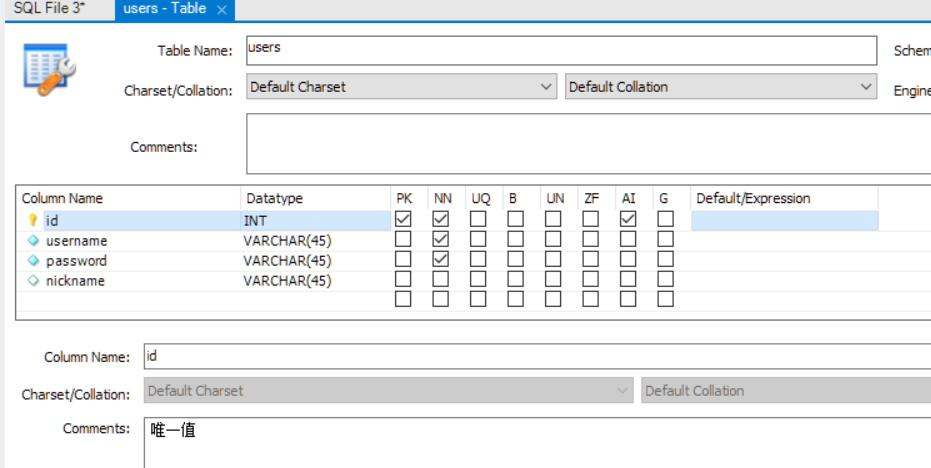

# workbench

安装 `mysql workbench` 方便可视化操作

## 新建表

1. 新建数据库，菜单栏上方
   create a new schema in the connected server

- 展示所有数据库
  `show databases;`
- 使用某个库
  `use weibo_db;`

2. 新建表，选中某个库的 Tables 右键 Create Table  
   设置列名和字段类型等

- PK：Primary Key
- NU：Not Null
- AI：Auto Increment，自增，比如生成唯一值，最快的方式就自增
    
  下方的 Comments 可以加注释，点击 Apply，自动生成对应的 SQL 语句。  
  上述的图等价于

```sql
CREATE TABLE `weibo_db`.`users` (
  `id` INT NOT NULL AUTO_INCREMENT COMMENT '唯一值',
  `username` VARCHAR(45) NOT NULL,
  `password` VARCHAR(45) NOT NULL,
  `nickname` VARCHAR(45) NULL,
  PRIMARY KEY (`id`));
```
