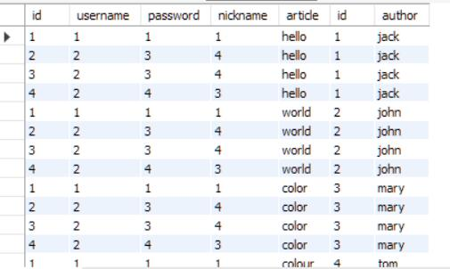

# 多个查询

## 嵌套查询

比如查询 id 位于 article 表内的 users 表的 id

```sql
select *
from weibo_db.users
where id in (select id from weibo_db.article where id > 2);
```

子选项只能是单列，否则会有歧义

## 联结查询

大数据时一般用联结查询代替嵌套，DBMS 会对联结查询做优化  
一类数据一个表，各表之间通过共同的值进行关联  
比如查询两个表，此时两个表之间的列不能重复  
`select * from weibo_db.users, weibo_db.article;`  
显示两个表的所有内容（笛卡尔积：行数是各自表格行数相乘）  


### 内联结

inner join: 两个表之间的相等取值。即两个表交集  
`inner join 表明 on where的条件`

```sql
use weibo_db;
select username from users inner join article on users.id = article.id;
```

### 自联结

self-join
即查询本表，一般用别名

```sql
use weibo_db;
select a.nickname from users as a, users as b where a.username = b.username and b.nickname = "4";
```

### 自然联结

natural-join  
多个表可能存在相同的列名，自然联结表示选择列名时只能选不重复的列名

### 外联结

outer-join  
除了列出两个表之间的相等取值的记录意外，还包括表本身不符合的内容  
比如存在两个表
users 如下
| id | username | password | nickname |
| --- | -------- | -------- | -------- |
| 1 | 1 | 1 | jack |
| 2 | 2 | 3 | john |
| 3 | 2 | 3 | 4 |
| 4 | 2 | 4 | 3 |
| 5 | 2 | 4 | hi |
article 如下  
| article | id | author |
| ------- | --- | ------ |
| hello | 1 | jack |
| world | 2 | john |
| color | 3 | mary |
| colour | 9 | tom |
左联结：以左表为准，返回左表的内容，不存在的值为 null
left outer join on/left join on
`select username, author from users left join article on users.id = article.id;`  
| username | author |
| -------- | ------ |
| 1 | jack |
| 2 | john |
| 2 | mary |
| 2 | null |
| 5 | null |
右联结：以右表为准，返回右表的所有内容，不存在的值为 null
right outer join on/right join on  
`select username, author from users right join article on users.id = article.id;`  
| username | author |
| -------- | ------ |
| 1 | jack |
| 2 | john |
| 2 | mary |
| null | tom |
