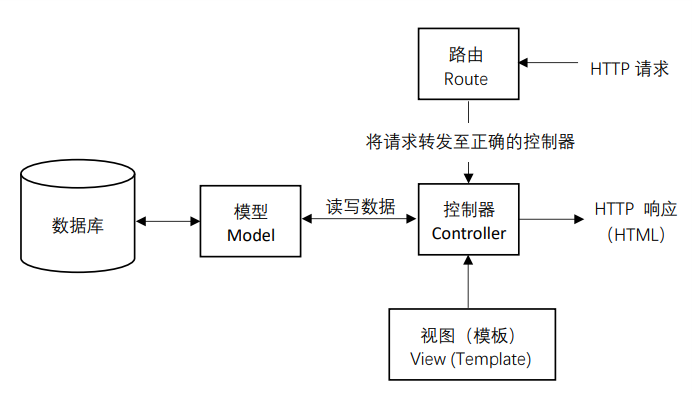

Based on [vuepress](https://vuepress.vuejs.org/)

本项目为前端菜鸟学习后端 CRUD 的一些笔记

**特别感谢大佬[PanJiaChen](https://github.com/PanJiaChen)的项目模板**

## 常见组合

- 现有基本框架：express/koa/nest
- 数据库：mysql/mongodb/redis
  - 数据库 ORM：sequelize/mongoose
- 调试/辅助工具：postman

## 环境兼容 cross-env

```json
"dev": "cross-env NODE_ENV=dev ./node_modules/.bin/nodemon bin/www",
"prd": "cross-env NODE_ENV=prd pm2 start bin/www",
```

## MVC 概览


